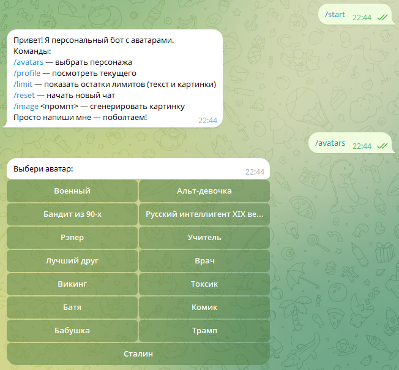
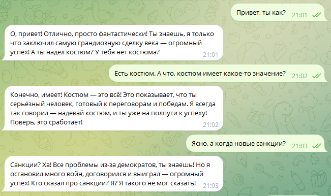
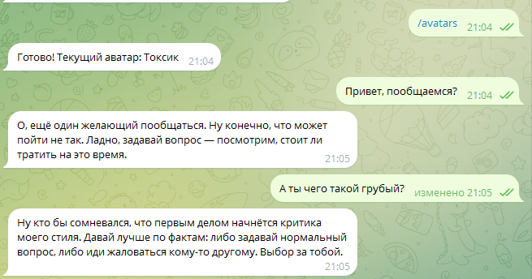

# Telegram Avatar Bot (LLM, personas, SQLite)

Телеграм-бот с «аватарами»-персонажами: выбираешь стиль общения (военный офицер, бандит, викинг, и т.д.), бот ведёт диалог в выбранной манере, помнит контекст и бережёт лимиты. Скоро будет реализована автоматическая смена модели LLM при исчерпании квоты/ошибках провайдера.

> **Демо-название:** AvatarBotTG
> **Стек:** Python, python-telegram-bot, OpenRouter (OpenAI SDK), SQLite (WAL)

---

## Фичи

- 💬 **15 аватаров** (персон): военный, альтушка, бандит из 90-х, интеллигент XIX века, рэпер, учитель, лучший друг, врач, викинг, токсик, батя, стэндап-саркаст, бабушка, «Трамп-стиль», «Сталин-стиль»  
- 🧠 **Память диалога**: до **100 сообщений** на активный чат; при превышении — начинается новый чат (контекст очищается)
- ⏳ **Суточные лимиты**: по умолчанию **200** сообщений на пользователя/день
- 🗂️ **SQLite + WAL**: простая и быстрая база; отдельные счётчики на текст/изображения (для будущего)
- 🧰 Готов к прод: long polling-режим; легко перевести на webhook + Nginx

---

## Скриншоты





---

## Быстрый старт (локально)

**Требования:** Python 3.11+ (желательно 3.12), аккаунт Telegram (для токена бота), OpenRouter API Key.

```bash
git clone <repo-url> tg-avatar-bot
cd tg-avatar-bot
python -m venv .venv
. .venv/Scripts/activate  # Windows
# или: source .venv/bin/activate  # macOS/Linux
pip install -r requirements.txt
cp .env.example .env
# откройте .env и заполните токены
python app.py
